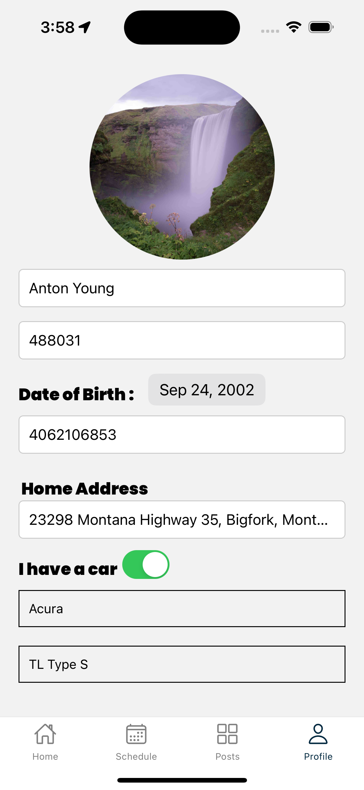
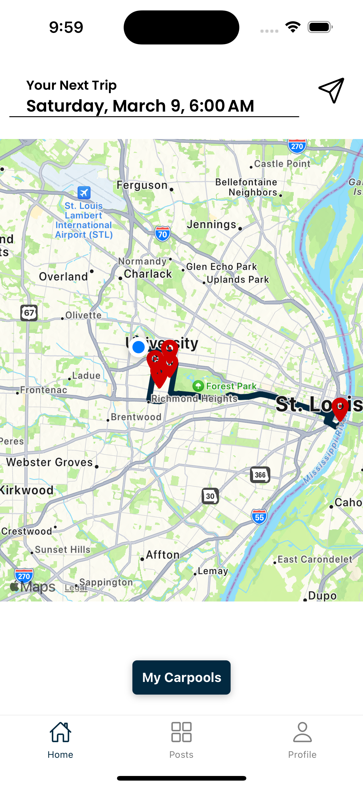

# Semester-Project

Ride Along is a carpooling app designed to make ridesharing more affordable for college students.

## Demo Images

<!-- Image 1 -->

<!-- Image 2 -->

<!-- Image 3 -->

<!-- Image 4 -->

<!-- Image 5 -->

<!-- Image 6 -->

<!-- Image 7 -->

<!-- Image 8 -->

<!-- Image 9 -->

<!-- Image 10 -->

<!-- Image 11 -->

<!-- Image 12 -->

<!-- Image 13 -->

<!-- Image 14 -->

<!-- Image 15 -->

