# Semester-Project

Jan 2024 - April 2024

Ride Along is a carpooling app designed to make ridesharing more affordable for college students.

Technologies Used: React Native & Expo, jest, Node.js, Mysql, AWS EC2.

## Demo Images

  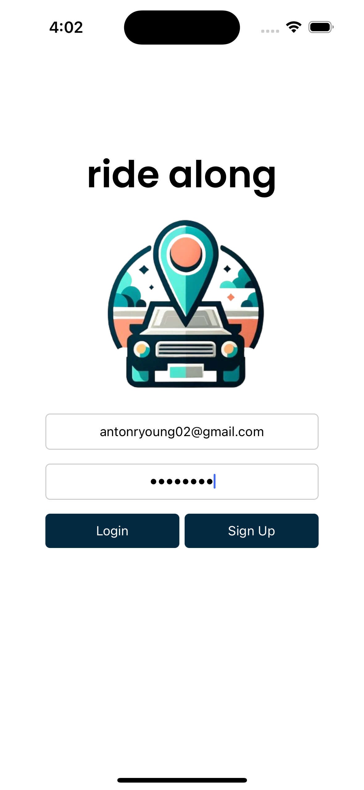
  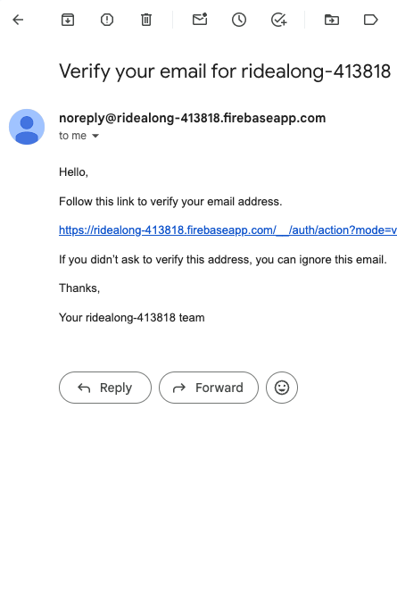
  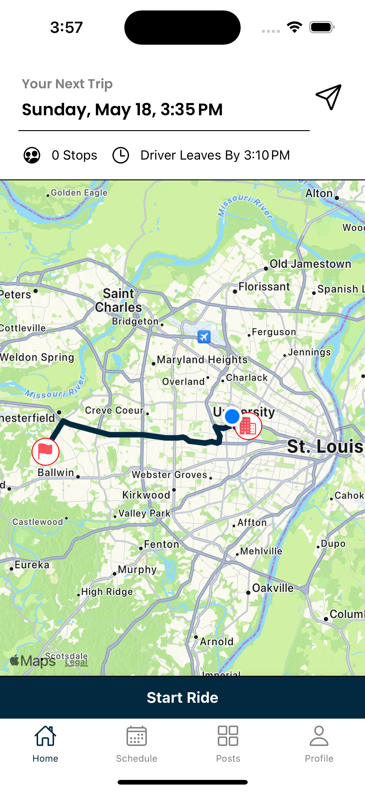

### Opening the app, if you were not signed in previously you are greeted with a login/signup screen. Upon successful login/signup with email verification, you are greeted with the homepage that displays your next upcoming trip details.

  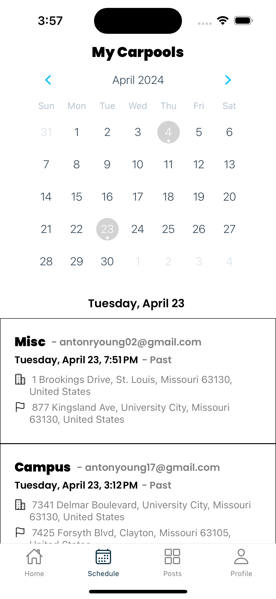
  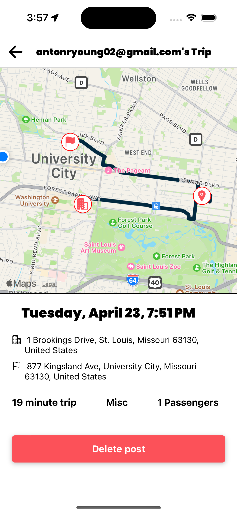

 
 

### The scheduling page shows your past and upcoming ride schedule, where you can view and cancel your trips.

    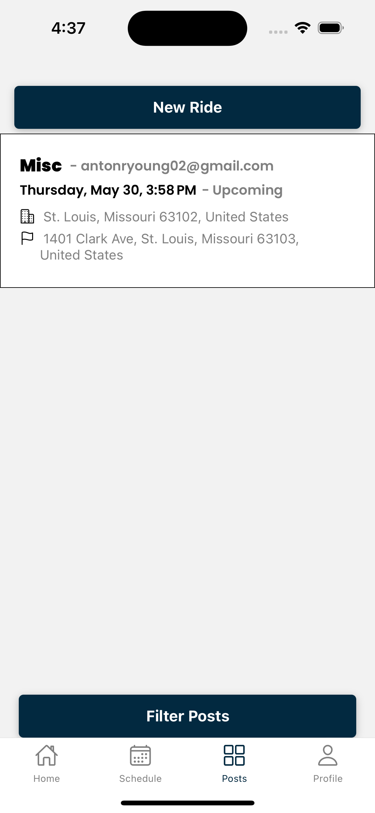
  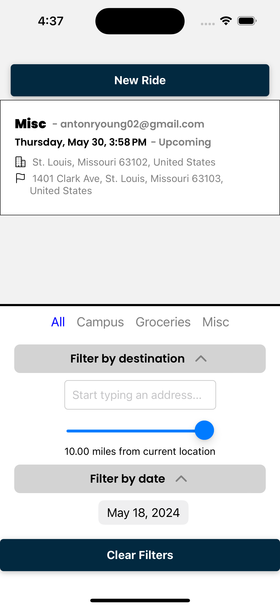
  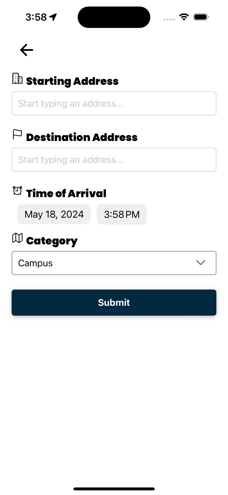
  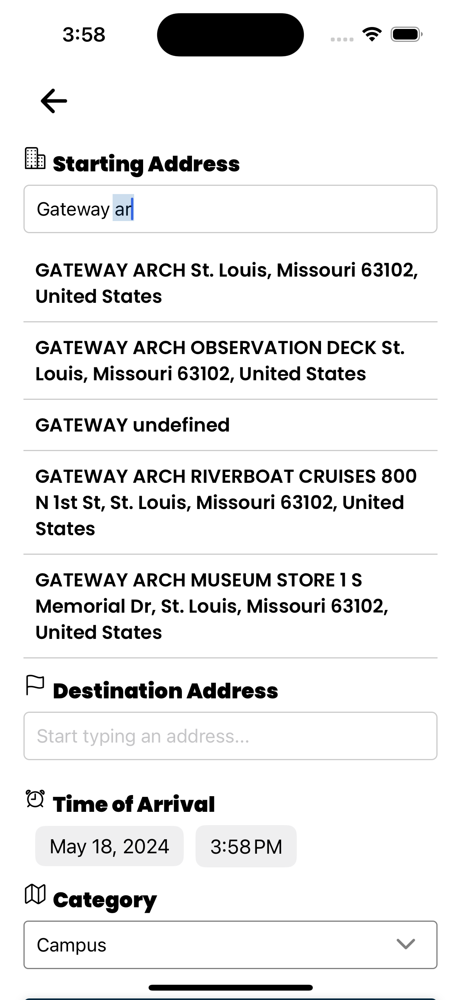

### The posts page shows upcoming trips made by other drivers. You can filter posts by distance from a location, date, and trip category. You can make a new post with location suggestions.

  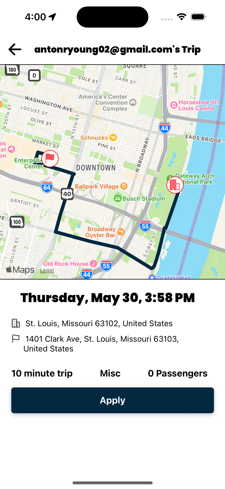
  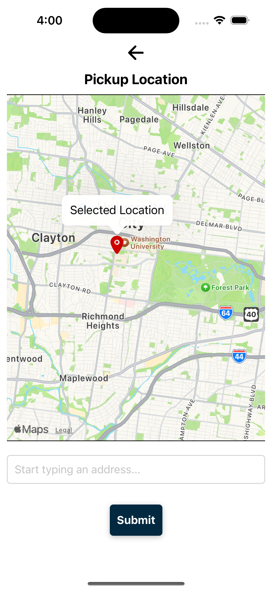

### Pressing on a post in the post page shows you details of the trip, and lets you request a stop by placing a marker or entering an address.

  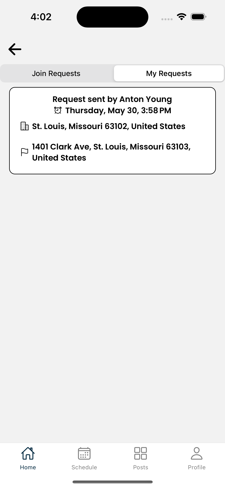
  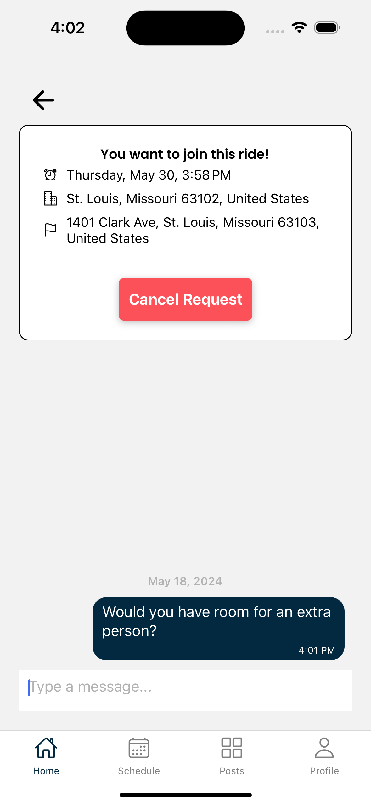
  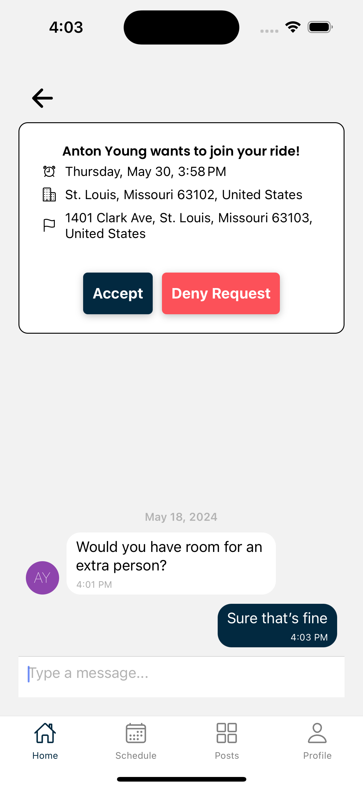

### These requests go to your/driver's message inbox in the Home page, where users can message and accept/deny/cancel the request

  
  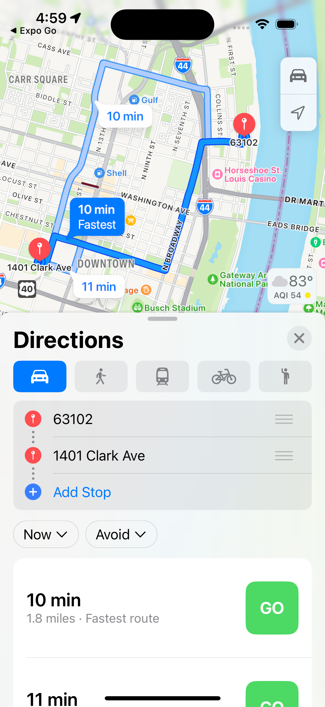

### The "start ride" button for the driver opens the route in apple maps
